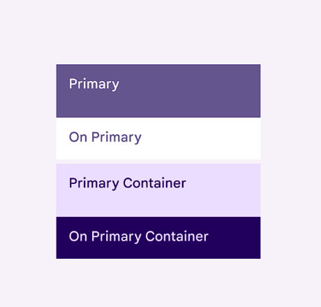
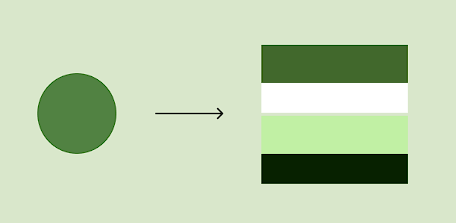

<div style="display:flex;justify-content:center;">

</div>

---

[![NPM version][npm-version-src]][npm-version-href]
[![License][license-src]][license-href]

Design see [m3.material.io/styles](https://m3.material.io/styles)

## Typography

For example, using Sass:

```scss
@use 'material3-style/typography/css';

// Or you can include it yourself
@use 'material3-style/typography';
:root {
  @include typography.theme();
}

.prose:not(:where([class~='not-prose'] *)) {
  @include typography.typography();
}

.prose-ul-star:not(:where([class~='not-prose'] *)) {
  @include typography.ul-star();
}
```

And add `prose` class to your content container:

```html
<body>
  <article class="prose">
    <!-- your content -->
    <h1>...</h1>
  </article>
</body>
```

You can also directly insert the link tag:

```html
<html>
  <head>
    <link
      rel="stylesheet"
      href="path/to/material3-style/typography/css/index.css"
    />
  </head>
  <body class="prose">
    <!-- your content -->
  </body>
</html>
```

## Color

Using Sass:

```scss
@use 'material3-style/color';

:root {
  @include var.light-theme();
}

.dark:root {
  @include var.dark-theme();
}

body {
  color: var(--m3-color-on-surface);
  background: var(--m3-color-surface);
}
```

Material3 Style also provides CSS files with two themes of bright and dark(`material3-style/color/css/dark-theme.css`, `material3-style/color/css/light-theme.css`).

### Change source color

The default source color is `#673ab7`.



You can change the source color using the following command:

```bash
npm material3-style color -s "#518242"
```

Then, you will get a new theme palette!



## Roadmap

- [x] typography
- [x] color
- [ ] elevation
- [ ] shape
- [ ] motion

## License

[MIT](./LICENSE) License © 2023 [Riri](https://github.com/Daydreamer-riri)

[npm-version-src]: https://img.shields.io/npm/v/material3-style?style=flat&colorA=080f12&colorB=1fa669
[npm-version-href]: https://www.npmjs.com/package/material3-style
[license-src]: https://img.shields.io/github/license/daydreamer-riri/material3-style.svg?style=flat&colorA=080f12&colorB=1fa669
[license-href]: https://github.com/daydreamer-riri/material3-style/blob/main/LICENSE
