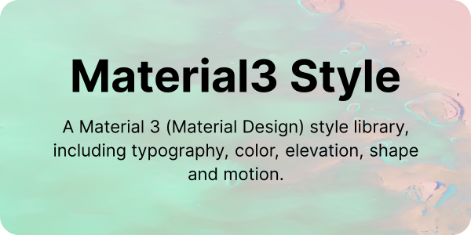

---

[![NPM version][npm-version-src]][npm-version-href]
[![License][license-src]][license-href]

see [m3.material.io/styles](https://m3.material.io/styles)

## Roadmap

- [x] typography
- [x] color
- [ ] elevation
- [ ] shape
- [ ] motion

## License

[MIT](./LICENSE) License © 2023 [Riri](https://github.com/Daydreamer-riri)

[npm-version-src]: https://img.shields.io/npm/v/material3-style?style=flat&colorA=080f12&colorB=1fa669
[npm-version-href]: https://www.npmjs.com/package/material3-style
[license-src]: https://img.shields.io/github/license/daydreamer-riri/material3-style.svg?style=flat&colorA=080f12&colorB=1fa669
[license-href]: https://github.com/daydreamer-riri/material3-style/blob/main/LICENSE
